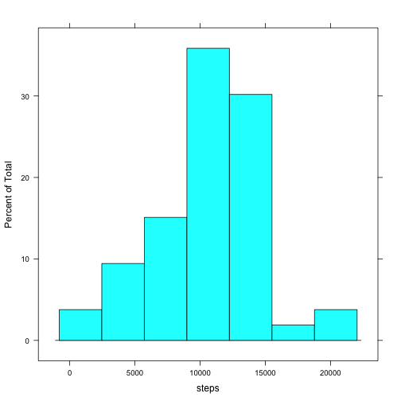
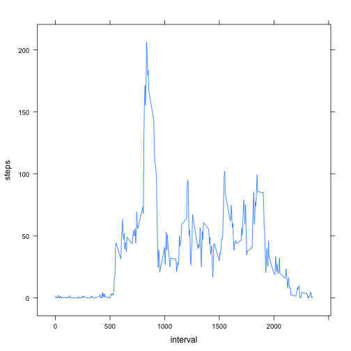
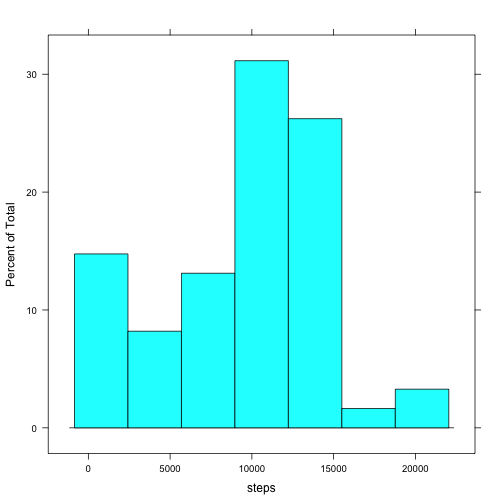
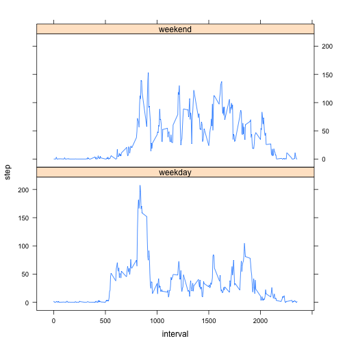

# Reproducible Research: Peer Assessment 1


## Loading and preprocessing the data

```r
raw_activity_data <- read.csv(unz('activity.zip', 'activity.csv'))
```

Convert date to Date class

```r
raw_activity_data$date <- as.Date(raw_activity_data$date)
```

Remove rows steps is NA

```r
activity_data <- raw_activity_data[!is.na(raw_activity_data$steps),]
```

make data table for fast data manipulation

```r
library(data.table)
DT <- data.table(activity_data)
```

## What is mean total number of steps taken per day?

```r
library(lattice)
total_steps_per_day <- DT[, sum(steps), by=date]
histogram(total_steps_per_day$V1, title='Histogram of total steps per day', xlab='steps') 
```

 

### Mean and median total number of steps taken per day.

```r
data.frame('mean'=mean(total_steps_per_day$V1),'median'=median(total_steps_per_day$V1))
```

```
##    mean median
## 1 10766  10765
```


## What is the average daily activity pattern?

```r
dap <- DT[, mean(steps), by=interval]
xyplot(dap$V1 ~ dap$interval, type='l', xlab='interval', ylab='steps')
```

 

### 5 minites interval contains maximum number of steps

```r
dap[dap$V1==max(dap$V1),]
```

```
##    interval    V1
## 1:      835 206.2
```

## Imputing missing values
Note that there are a number of days/intervals where there are missing values (codes as `NA`). The presence of missing days may introduce bias into some calculations or summaries of the data

1. Calculate and report the total number of missing values in the dataset.

```r
table(is.na(raw_activity_data$steps))
```

```
## 
## FALSE  TRUE 
## 15264  2304
```

2. Device a strategy for filling in all missing values in the dataset.
Let's fill NA with latest non NA value. With na.locf from zoo library, it's pretty easy

3. Create a new dataset that is equal to the original dataset but with the missing data filled in

```r
library(zoo)
```

```
## 
## Attaching package: 'zoo'
## 
## The following objects are masked from 'package:base':
## 
##     as.Date, as.Date.numeric
```

```r
na_filled <- na.locf(raw_activity_data)
na_filled$steps <- as.numeric(na_filled$steps)
```
4. Make a histogram of the total number of steps taken each day and Calculate and report **mean** and **median** total number of steps taken per day.


```r
na_filled_DT <- data.table(na_filled)
na_filled_tspd <- na_filled_DT[, sum(steps), by=date]
histogram(na_filled_tspd$V1, title='histogram of total steps per day with missing values filled with latest non NA values', xlab='steps')
```

 


## Are there differences in activity patterns between weekdays and weekends?
It seems people are much more active all day in week end rather in weekday people are only active in the morning.


```r
library(reshape)
na_filled$date <- as.Date(na_filled$date)
na_filled$weekday_end <- !weekdays(na_filled$date) %in% c("Sunday", "Saturday")
mdata <- melt(na_filled, id=c('date', 'weekday_end', 'interval'))
res <- cast(mdata, interval ~ weekday_end ~ variable, function(x) mean(x, na.rm=TRUE))
res_df <- data.frame(res)
int_df <- data.frame(unique(mdata$interval))
res_df <- cbind(int_df, res_df)
we_df <- res_df[, c(1,2)]
wd_df <- res_df[, c(1,3)]
colnames(we_df) <- c('interval', 'step')
colnames(wd_df) <- c('interval', 'step')
we_df$f <- 'weekend'
wd_df$f <- 'weekday'
result <- rbind(we_df, wd_df)
result$interval <- as.numeric(as.character(result$interval))
xyplot(step ~ interval | f, data=result, type='l', layout=c(1,2))
```

 
